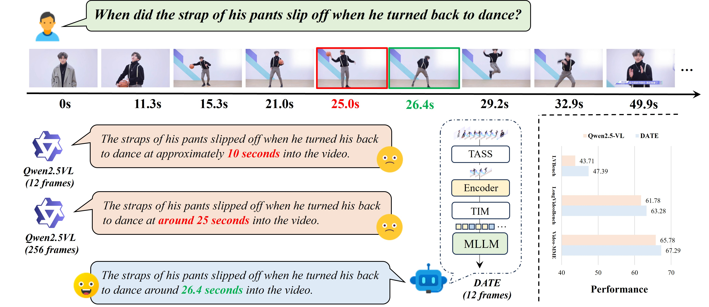
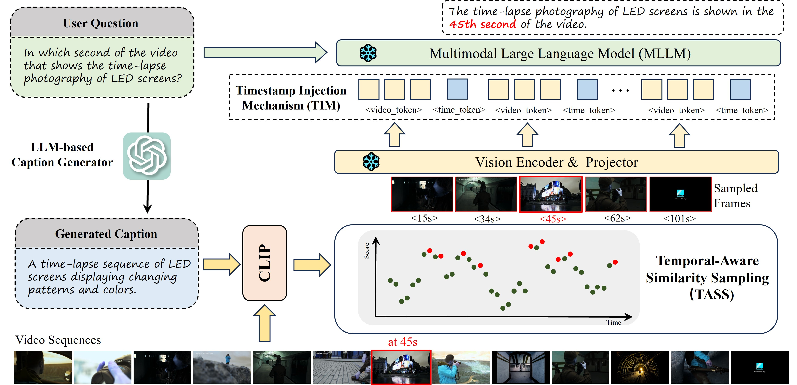
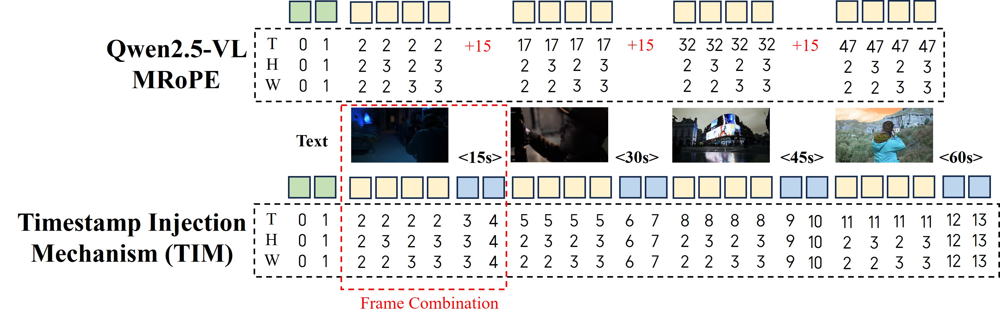
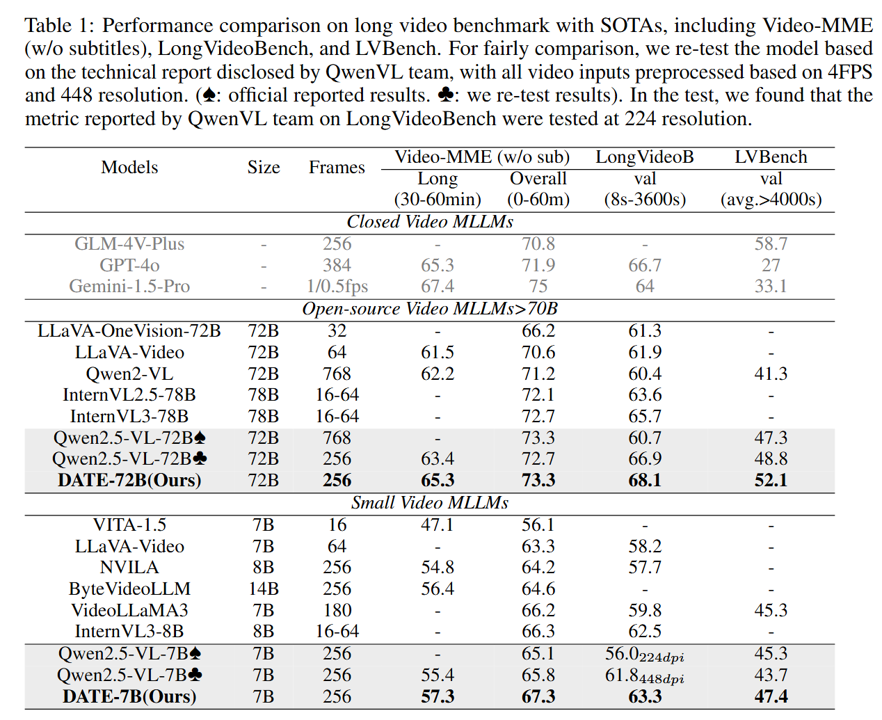
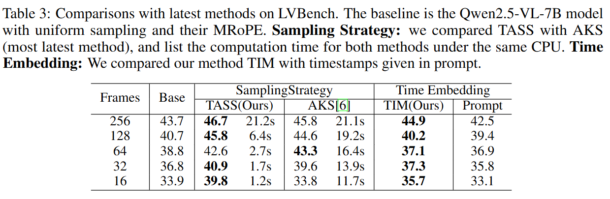

<h1 align='center'>DATE: Dynamic Absolute Time Enhancement for Long Video Understanding</h1>

<div align='center'>
    <a href='http://arxiv.org/abs/2509.09263'></a>
</div> 

<p align="center"><i>🔥 A Plug-and-Play method (TIM) to empower absolute time understanding for MRoPE of Qwen2.5-VL🔥</i></p>

<p align="center"><i>🔥 A state-of-the-art video sampling (TASS) for video mllm🔥</i></p>



## 📖 Introduction
This repository is the official implementation of the paper "DATE: Dynamic Absolute Time Enhancement for Long Video Understanding". We propose a plug-and-play method, **TIM**, to empower **real absolute time understanding** for MRoPE of Qwen2.5-VL. Additionally, we introduce **TASS (Time-Aware Sampling Strategy)**, a state-of-the-art video sampling method that enhances video understanding by selecting frames based on their relevance to the input query.





<!-- ## 📢 News -->
<!-- * [2025.07.10] 🔥🔥🔥 Paper is available on [Arxiv]()! -->

## 🚀 How to use TIM?

1. Replace the original Qwen2.5-VL's with two lines:
```python
transformers.models.qwen2_5_vl.processing_qwen2_5_vl.Qwen2_5_VLProcessor.__call__ = date_processing_qwen2_5_vl__call__
transformers.models.qwen2_5_vl.modeling_qwen2_5_vl.Qwen2_5_VLForConditionalGeneration.get_rope_index = date_get_rope_index
```

2. Get `timestamps` when loading video, and pass them to the Qwen2.5-VL's processor:
```python
inputs = processor(text=[text_prompt], videos=[video], padding=True, return_tensors="pt", timestamps=timestamps)
```


## 🚀 How to use TASS?

1. Generate a better caption based on input query (optional):
```python
from utils.query import chatcompletions
caption = chatcompletions(question = question)
```

2. Get scores for each frame:
```python
from utils.clip_sim import process_video_question
scores, timestamps, ids, embedding = process_video_question(video_path, caption, fps=2)
```

3. Use TASS to sample frames:
```python
from utils.sampling import tass_sampling
final_timestamps, final_indices = tass_sampling(timestamps, scores, topk=None, max_frames=256)
```

## ⚒️ Quick Start
1. Install the environment according to the official documentation of  [Qwen2.5-VL](https://github.com/QwenLM/Qwen2.5-VL).
2. Modify the input settings in `demo.py` lines 200-202.

## 📊 Experiments


